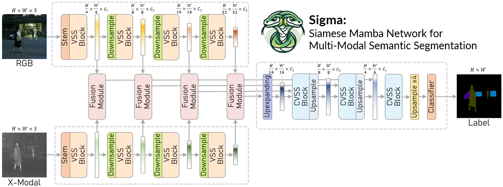
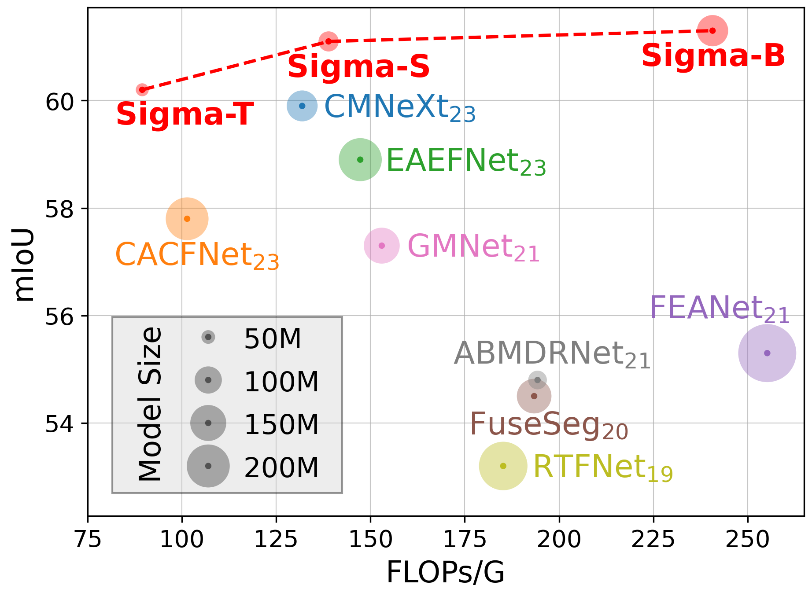

<div align="center">
<h1> Soil Fusion Mamba: Soil Fusion Mamba Network for Multi-Modal Soil Segmentation </h1>

[Zifu Wan](https://zifuwan.github.io/)<sup>1</sup>, [Yuhao Wang](https://924973292.github.io//)<sup>2</sup>, [Silong Yong](https://silongyong.github.io/)<sup>1</sup>, [Pingping Zhang](https://scholar.google.com/citations?user=MfbIbuEAAAAJ&hl=zh-CN)<sup>2</sup>, [Simon Stepputtis](https://simonstepputtis.com/)<sup>1</sup>, [Katia Sycara](https://scholar.google.com/citations?user=VWv6a9kAAAAJ&hl=en)<sup>1</sup>, [Yaqi Xie](https://yaqi-xie.me/)<sup>1</sup></sup>

<sup>1</sup>  Robotics Institute, Carnegie Mellon University, USA  
<sup>2</sup>  School of Future Technology, Dalian University of Technology, China

[](https://arxiv.org/abs/2404.04256) [](https://opensource.org/licenses/MIT)
[](https://x.com/_akhaliq/status/1777272323504025769)


</div>


## 👀Introduction

This repository contains the code for our paper `Sigma: Siamese Mamba Network for Multi-Modal Semantic Segmentation`. [[Paper](https://arxiv.org/abs/2404.04256)]



`Sigma`, as a lightweight and efficient method, reaches a balance between accuracy and speed. (Results below are calculated on [MFNet](https://github.com/haqishen/MFNet-pytorch) dataset)



## 💡Environment

We test our codebase with `PyTorch 1.13.1 + CUDA 11.7` as well as `PyTorch 2.2.1 + CUDA 12.1`. Please install corresponding PyTorch and CUDA versions according to your computational resources. We showcase the environment creating process with PyTorch 1.13.1 as follows.

1. Create environment.
    ```shell
    conda create -n sigma python=3.9
    conda activate sigma
    ```

2. Install all dependencies.
Install pytorch, cuda and cudnn, then install other dependencies via:
    ```shell
    pip install torch==1.13.1+cu117 torchvision==0.14.1+cu117 torchaudio==0.13.1 --extra-index-url https://download.pytorch.org/whl/cu117
    ```
    ```shell
    pip install -r requirements.txt
    ```

3. Install Mamba
    ```shell
    cd models/encoders/selective_scan && pip install . && cd ../../..
    ```

## ⏳Setup

### Datasets

1. We use Three datasets, including both Surface Soil and Soil Profile datasets:
    - [Surface Soil](Data Privacy)
    - [Soil Profile](Data Privacy)
    - [Mexican soil profile](https://data.mendeley.com/datasets/v9krcvzv27/1)

    Please refer to the original dataset websites for more details. You can directly download the processed RGB-Depth datasets from [DFormer](https://github.com/VCIP-RGBD/DFormer?tab=readme-ov-file), though you may need to make small modifications to the txt files.

2. <u>We also provide the processed datasets (including RGB-Thermal and RGB-Depth) we use here: [Google Drive Link](https://drive.google.com/drive/folders/1GD4LYF208h9-mHJ_lxW11UM0TPlRmv0z?usp=drive_link).</u>

3. If you are using your own datasets, please orgnize the dataset folder in the following structure:
    ```shell
    <datasets>
    |-- <DatasetName1>
        |-- <RGBFolder>
            |-- <name1>.<ImageFormat>
            |-- <name2>.<ImageFormat>
            ...
        |-- <ModalXFolder>
            |-- <name1>.<ModalXFormat>
            |-- <name2>.<ModalXFormat>
            ...
        |-- <LabelFolder>
            |-- <name1>.<LabelFormat>
            |-- <name2>.<LabelFormat>
            ...
        |-- train.txt
        |-- test.txt
    |-- <DatasetName2>
    |-- ...
    ```

    `train.txt/test.txt` contains the names of items in training/testing set, e.g.:

    ```shell
    <name1>
    <name2>
    ...
    ```


## 📦Usage

### Training
1. Please download the pretrained [VMamba](https://github.com/MzeroMiko/VMamba) weights:

    - [VMamba_Tiny](https://drive.google.com/file/d/1W0EFQHvX4Cl6krsAwzlR-VKqQxfWEdM8/view?usp=drive_link).
    - [VMamba_Small](https://drive.google.com/file/d/1671QXJ-faiNX4cYUlXxf8kCpAjeA4Oah/view?usp=drive_link).
    - [VMamba_Base](https://drive.google.com/file/d/1qdH-CQxyUFLq6hElxCANz19IoS-_Cm1L/view?usp=drive_link).

    <u> Please put them under `pretrained/vmamba/`. </u>


2. Config setting.

    Edit config file in the `configs` folder.    
    Change C.backbone to `sigma_tiny` / `sigma_small` / `sigma_base` to use the three versions of Sigma. 

3. Run multi-GPU distributed training:

    ```shell
    NCCL_P2P_DISABLE=1 CUDA_VISIBLE_DEVICES="0,1,2,3" python -m torch.distributed.launch --nproc_per_node=4  --master_port 29502 train.py -p 29502 -d 0,1,2,3 -n "dataset_name"
    ```

    Here, `dataset_name=mfnet/pst/nyu/sun`, referring to the four datasets.

4. You can also use single-GPU training:

    ```shell
    CUDA_VISIBLE_DEVICES="0,1,2,3,4,5,6,7" torchrun -m --nproc_per_node=1 train.py -p 29501 -d 0 -n "dataset_name" 
    ```
5. Results will be saved in `log_final` folder.


### Evaluation
1. Run the evaluation by:

    ```shell
    CUDA_VISIBLE_DEVICES="0,1,2,3,4,5,6,7" python eval.py -d="0" -n "dataset_name" -e="epoch_number" -p="visualize_savedir"
    ```

    Here, `dataset_name=mfnet/pst/nyu/sun`, referring to the four datasets.\
    `epoch_number` refers to a number standing for the epoch number you want to evaluate with. You can also use a `.pth` checkpoint path directly for `epoch_number` to test for a specific weight.

2. If you want to use multi GPUs please specify multiple Device IDs:

    ```shell
    CUDA_VISIBLE_DEVICES="0,1,2,3,4,5,6,7" python eval.py -d="0,1,2,3,4,5,6,7" -n "dataset_name" -e="epoch_number" -p="visualize_savedir"
    ```

3. Results will be saved in `log_final` folder.

## 📈Results

We provide our trained weights on the four datasets:

### MFNet (5 categories)
| Architecture | Backbone | mIOU | Weight |
|:---:|:---:|:---:|:---:|
| Sigma | VMamba-T | 60.2% | [Sigma-T-MFNet](https://drive.google.com/file/d/1N9UU9G5K8qxKsZOuEzSLiCGXC5XCaMaU/view?usp=drive_link) |
| Sigma | VMamba-S | 61.1% | [Sigma-S-MFNet](https://drive.google.com/file/d/1heHnyvDTSa2oYxAD5wcgpIY3OZ198Cr2/view?usp=drive_link) |
| Sigma | VMamba-B | 61.3% | [Sigma-B-MFNet](https://drive.google.com/file/d/1an6pqLeEYHZZLOmfyY8A3ooKP8ZVMU93/view?usp=drive_link) |

## 🙏Acknowledgements

Our dataloader codes are based on [CMX](https://github.com/huaaaliu/RGBX_Semantic_Segmentation). Our Mamba codes are adapted from [Mamba](https://github.com/state-spaces/mamba) 、 [VMamba](https://github.com/MzeroMiko/VMamba) and [Fusion Mamba](https://github.com/zifuwan/Sigma). We thank the authors for releasing their code!

## 📧Contact

If you have any questions, please  contact at [zifuw@andrew.cmu.edu](mailto:zifuw@andrew.cmu.edu).

## 📌 BibTeX & Citation

If you find this code useful, please consider citing our work:

```bibtex
@article{wan2024sigma,
  title={Sigma: Siamese Mamba Network for Multi-Modal Semantic Segmentation},
  author={Wan, Zifu and Wang, Yuhao and Yong, Silong and Zhang, Pingping and Stepputtis, Simon and Sycara, Katia and Xie, Yaqi},
  journal={arXiv preprint arXiv:2404.04256},
  year={2024}
}
```

